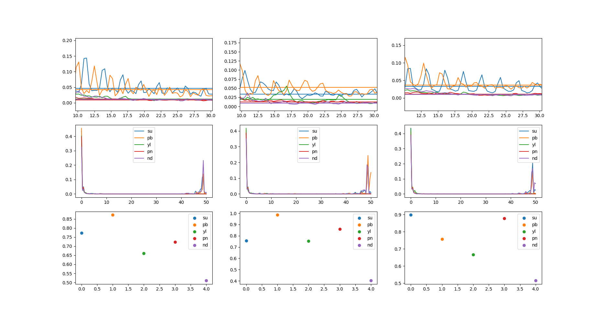
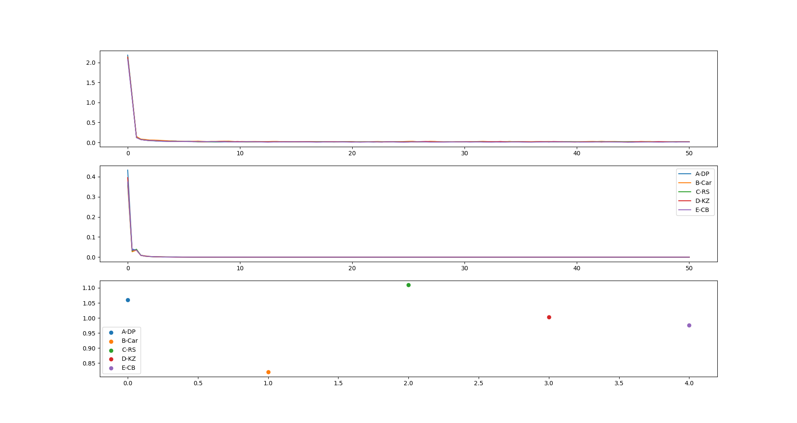

# TEAM 51 : Spykers | ntx-hack-23
Repository for Team 51's submission to NTX Hackathon 2023.

## Objective: Testing if EEG can be used to deduce Focus

### Getting Started
All code was tested on a Ubuntu 20.04 machine running Python 3.10. Required packages can be installed through:
```sh
pip install -r requirements.txt
```

### Repository Navigation
#### read_serial.py
Reads serial EEG data from a configurable port and pickles the data for future use.

#### experiments/\*.pkl
Recorded EEG signals used for hypothesis testing. These can be sub-divided as:
+ record\_\*\_focus.pkl: Baseline EEG activity.
+ record\_\*\_music_c.pkl: EEG activity when listening to music that the user likes.
+ record\_\*\_music_d.pkl: EEG activity when listening to music that the user does not like.
+ record\_sample\*.pkl: EEG data of the user listening to various tracks.

#### experiments/compare\*.py
Hypothesis testing under specific scenarios.
+ compare_feature_usd.py: Tests to determine an indicator feature.
+ compare_feature_likeness.py: Compares User Ratings and our Hypothesis for different tracks

#### music_player.py
Music player with auto-recommender system based off of our indicator feature. Still a work in progress.

#### results/\*png
Hypothesis Testing results. These can be grouped as two types

+ plt\*.png:
Hypothesis and Track Testing outputs produced by `compare_feature_usd.py` and `compare_feature_likeness.py`

+ pb\*.png:
Correlation based indicator feature testing done using Backyard Brain's Spike Recorder.

## Results
### Hypothesis Tests
In our intial testing, we used this plot to determine the beta-alpha energy ratio as a decent indicator function:


To verify our hypothesis, we compared different tracks, which matched our hypothesis:


The results for correlation tests can be found under the [results](./results/) folder.